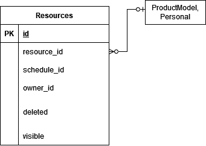

# API

## ER-диаграмма связанных сущностей

 

## Описание сущности Resources 
   1. id,
   2. ResourceId - ссылка на конкретный ресурс (например, в таблице Personal/ProductModel),
   3. ScheduleId - ссылка в микросервис Resource Schedule Template на выбранный график использования ресурса,
   4. OwnerId - владелец ресурса.
   5. Deleted - флаг удаления.
   6. Visible - флаг видимости. 
   
## Функции (эндпониты)

1. CRUDS (create, read, update, delete, search) для Resources
   1. create
   2. read by id
   3. update by id
   4. delete, setting the flag 'deleted'.
   5. search by id
